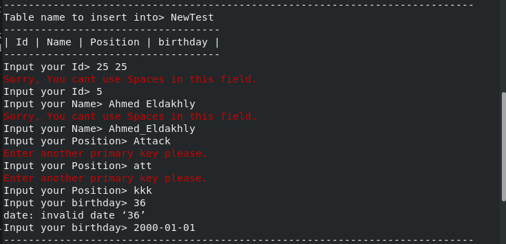

# Simple Database using Bash shell script

<p align="center">


</p>


# Team Members

## Ahmed Eldakhly.
## Mostafa Yossef.
            
#

# Repository Link.
[Simple Database System With GUI](https://github.com/Ahmed-Eldakhly/Simple-database-bash-shell-script.git)

#

# Operations with Photos

## Run the application.
Using terminal run start-DBMS.sh file.


Now The application will work with for main functions.


#

# Main Functions.

## 1 - Create Database.
This option ask the user for the name of database and if it didn't exist before and the name without spaces, the application will create it as a folder inside Database schema folder.


## 2 - List Databases.
This option makes a list for all Databases in the application.


## 3 - Drop Databases.
This option remove Databases from the system with check if the database is empty.


## 4 - Connect Databases.
Connect with databases using its name and show table menu to make operations on its tables (create - insert - drop - list - select - updete - delete).


#

# Operations on Tables.

## 1 - Create Tables.
This option ask the user for the name of Table and if it didn't exist before and don't have spaces in its name, the application will create it as a 2 files inside current Database folder (.TableName "Meta Data" - TableName) and start to ask the user to add new columns and its datatype (Integar - String - Date - Password) and ask the user about the primary key.

 

## 2 - List Tables.
This option makes a list for all Tables in the Database.


## 3 - Drop Tables.
This option move tables file to trash folder inside the Database. 

NOTE: The user can return it manually from the trash or delete it forever.


## 4 - Insert into table.
This option gives the user the ability to insert new record after selecting write table name with many checks (datatype check , primary key check , no empty fields check and no space in the same field).




## 5 - Select from table.
Ask the user about specific column and specific value to search for, the he can select which data will be displayed from table head (column names).


## 6 - Delete from table.
Ask the user about specific column and specific value to search for, then delete all matched records.


## 7 - Update table.
Ask the user about specific column and specific value to search for, then update all matched records one by one with all checks and display old values if he dosen't want to update any value of them.


#

# Project files.

1 - start-DBMS.sh

2 - database_logic.sh

3 - ddl.sh

4 - table-menu.sh

5 - dml.sh

6 - create-table.sh

7 - update-table.sh

8 - delete-from-table.sh

9 - select-from-table.sh

10 - globals.sh


# 

# Sample of codes.
Sample for Bash shell script files.
```
#------------------------------------------------------------------------------------
#Drop Databases by delete their folder if it exists.
function dropDb(){
	echo ------------------------------------------------------------------------
	#take the database name from user and check if it exists.
	read -p "DB name> " db_name
	dbExist $db_name
	dbExist=$?
	if [ $dbExist -eq 1 ]
	then
		#check if the database is empty to notify the user if it has tables.
		isDbEmpty $db_name
		isEmpty=$?
		if [ $isEmpty -eq 1 ]
		then
			echo "Empty schema"
		        rm "-dr" $db_name
		        echo -e "\e[32mDatabase removed successfully.\e[0m"
		else
		        echo "Database is not empty. Do you want to remove the database with its tables? [N/y]"
		        read ch
		        if [ $ch = y ]
		            then 
		                rm "-dr" $db_name
		                echo -e "\e[32mDatabase removed successfully.\e[0m"
		        fi
		fi
	else
		echo -e "\033[31m[X]\e[0m No database with this name found."
	fi
	echo ------------------------------------------------------------------------
}
```

#
